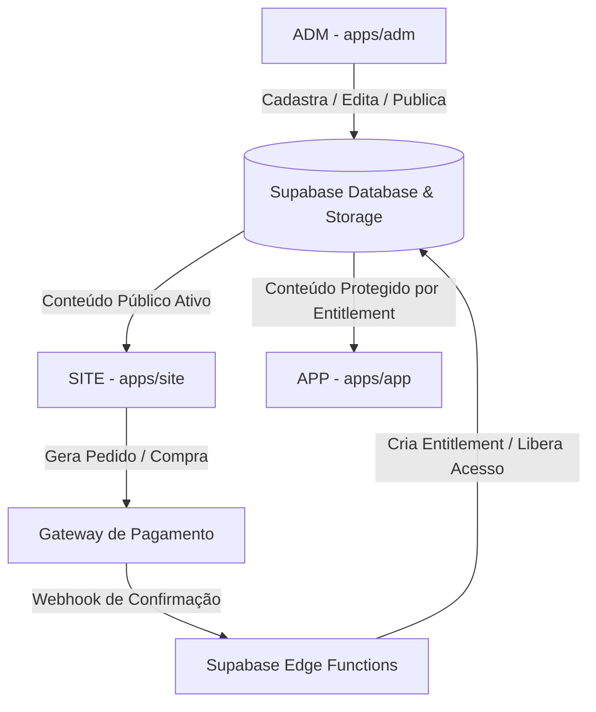

# 01 — ARQUITETURA TÉCNICA DO SISTEMA

## 1. Estrutura do Monorepo

O projeto **COM DEUS KIDS** é organizado como um **Monorepo gerenciado por npm workspaces**:

```text
COMDEUSKIDS/
├── apps/
│   ├── site/         # Aplicação Storefront / Pública (Porta 3000)
│   ├── adm/          # Painel Master & CMS (Porta 3001)
│   └── app/          # Plataforma de Streaming & Área de Membros (Porta 3002)
│
├── packages/
│   ├── supabase/     # Client Supabase compartilhado (@comdeuskids/supabase)
│   ├── types/        # Interfaces e Tipos TypeScript (@comdeuskids/types)
│   └── ui/           # Tokens CSS e componentes base (@comdeuskids/ui)
│
├── supabase/
│   ├── migrations/   # Scripts SQL versionados (schema, RLS, triggers)
│   └── functions/    # Edge Functions (ex: geração de checkout, webhooks)
│
├── docs/             # Documentação oficial e memória técnica do projeto
└── package.json      # Configuração dos workspaces e scripts de inicialização
```

---

## 2. As Três Aplicações Principais

### A. `apps/site` — Storefront & Descoberta Pública
* **Stack**: React 18 + Vite + React Router DOM 6.
* **Porta de Desenvolvimento**: `http://localhost:3000`.
* **Propósito**: Vender materiais digitais e planos de assinatura, apresentar as histórias bíblicas e indexar o conteúdo nos mecanismos de busca (SEO).
* **Referência Visual**: O site oficial em produção ([comdeuskids.com.br](https://comdeuskids.com.br/)).
* **Segurança**: Lê dados públicos (`status = 'published'` ou `'active'`). Não possui chaves privilegiadas (`service_role`).

### B. `apps/adm` — Painel Master & CMS Unificado
* **Stack**: React 18 + Vite + React Router DOM 6 + Lucide Icons.
* **Porta de Desenvolvimento**: `http://localhost:3001`.
* **Propósito**: Central de comando operacional. É onde o administrador:
  1. Gerencia o catálogo do **SITE** (Home, Categorias, Temas, Coleções, Menus, Banners, Planos e SEO).
  2. Publica os conteúdos do **APP** (Filmes, Séries, Episódios, Clipes, Músicas, PDFs e Quizzes).
  3. Monitora Pedidos, Assinaturas, Clientes, Contas Institucionais, Logs e Métricas Financeiras.
* **Referência Visual**: Padrão de design do **HUB TEKNIX** (cards claros, tipografia concisa, navegação em abas e modais organizados).

### C. `apps/app` — Área de Membros & Streaming Kids
* **Stack**: React 18 + Vite + React Router DOM 6 + Audio/Video HTML5 APIs.
* **Porta de Desenvolvimento**: `http://localhost:3002`.
* **Propósito**: Ambiente de consumo pós-venda para crianças, pais, professores de escolas e líderes de igrejas.
* **Módulos Centrais**:
  - Seleção e gerenciamento de múltiplos perfis infantis (com PIN para responsáveis).
  - Streaming de vídeo com player em tela cheia imersivo.
  - Player de música e louvores infantil global persistente.
  - Download e visualização de materiais e atividades em PDF.
  - Modo 10-Foot UI para navegadores de **Smart TV** (`/tv/*`) com navegação por controle remoto (teclas direcionais).
* **Referência Visual**: Design cinematográfico Stitch oficial (Dark `#0b0b0d`, acentos lilás/roxo `#7c3aed`).

---

## 3. Pacotes Compartilhados (`packages/`)

1. **`@comdeuskids/supabase`**:
   - Fornece a instância singleton do Supabase Client para os 3 apps.
   - Lê `import.meta.env.VITE_SUPABASE_URL` e `import.meta.env.VITE_SUPABASE_ANON_KEY`.
   - Garante que autenticação e persistência de sessão sejam unificadas.

2. **`@comdeuskids/types`**:
   - Centraliza todas as interfaces de dados (`Product`, `Category`, `Theme`, `StreamContent`, `Plan`, `Order`, `AccountProfile`, `WatchProgress`, etc.).
   - Evita tipos divergentes entre o que o ADM cadastra e o que o SITE/APP consomem.

3. **`@comdeuskids/ui`**:
   - Define tokens globais de cores, sombras e transições.

---

## 4. Fluxo de Dados e Comunicação



### Regras do Fluxo:
1. **Nenhuma comunicação direta entre frontends**: O SITE não faz requisições HTTP para o ADM, nem o ADM para o APP. Toda a comunicação ocorre de maneira desacoplada através do banco de dados e do Storage no **Supabase**.
2. **Atualização Imediata (Sem Necessidade de Deploy)**: Quando o ADM publica um produto ou altera o nome de uma categoria, o SITE e o APP passam a exibir os novos dados imediatamente na próxima consulta, sem necessidade de novo build.
3. **Cache Inteligente**: O SITE consome dados públicos cacheados para máxima velocidade de carregamento, invalidando ou revalidando quando detecta alterações no CMS.
