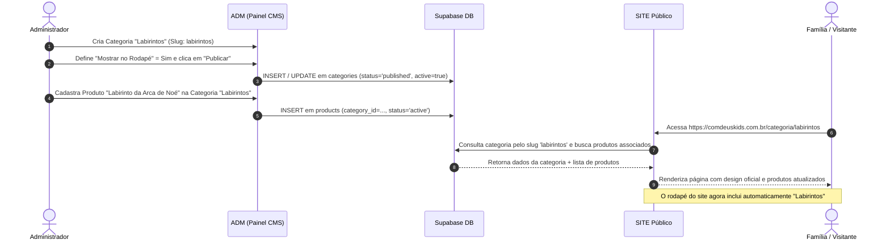

# 03 — SITE CMS: GERENCIAMENTO DINÂMICO DO SITE PELO ADM

Este documento estabelece o modelo operacional pelo qual o **ADM (`apps/adm`) atua como o CMS oficial do SITE público (`apps/site`)**.

---

## 1. Princípio Fundamental: Fim do Código Hardcoded

Nenhum elemento de conteúdo comercial ou editorial do site deve depender de alteração em arquivos `.tsx` ou de novo deploy para ser modificado.

```text
❌ ANTES (Incorreto):
const CATEGORIAS_SITE = ['Colorir', 'Labirintos', 'Quiz', 'Adesivos']

✅ DEPOIS (Correto):
const { data: categories } = await supabase
  .from('categories')
  .select('*')
  .eq('active', true)
  .order('sort_order', { ascending: true })
```

Toda categoria, tema, coleção, banner, item de menu ou plano adicionado no ADM passa a existir e a alimentar as rotas públicas correspondentes de forma automática.

---

## 2. Fluxo de Publicação e Exibição



---

## 3. Módulos do SITE Gerenciados pelo ADM

No menu lateral do ADM, a área **Site >** abriga as seguintes funcionalidades:

### 3.1. Visão Geral do Site
- Métricas rápidas: Total de produtos públicos ativos, categorias listadas, temas, coleções e status dos banners promocionais.

### 3.2. Categorias Públicas (`/categoria/:slug`)
- Cadastro do formato da atividade (ex: *Colorir*, *Labirintos*, *Caça-palavras*).
- Controle de visibilidade:
  - `[x] Mostrar no Site`
  - `[x] Mostrar no Menu Principal`
  - `[x] Mostrar no Rodapé`
  - `[x] Destacar na Home`
- Campo de ordem para definir a sequência de exibição nos carrosséis e listas.

### 3.3. Temas Bíblicos (`/tema/:slug`)
- Cadastro de assuntos das Escrituras (ex: *Jesus*, *Oração*, *Páscoa*, *Criação*).
- O SITE monta dinamicamente `/tema/pascoa`, listando todos os produtos vinculados ao tema Páscoa.

### 3.4. Coleções Editoriais (`/colecao/:slug`)
- Séries e pacotes especiais (ex: *Heróis da Fé*, *Histórias de Jesus*, *Antigo Testamento*).

### 3.5. Menus de Navegação (Header & Footer)
- Permite alterar a ordem e os links dos menus do site sem mexer no código:
  - **Menu Header**: Início, Coleções, Temas, Jesus, Planos, etc.
  - **Menu Footer**: Grupos Empresa, Produtos e Comece Agora.

### 3.6. Gestão da Home
- Controle dinâmico das seções da página inicial:
  - Título e subtítulo do Hero.
  - Texto e link do botão principal de ação (CTA).
  - Seleção das categorias e coleções em destaque.
  - Perguntas e Respostas Frequentes (FAQ).

### 3.7. Banners Promocionais
- Upload de imagem Desktop e imagem Mobile.
- Título, subtítulo, link de destino e período de vigência (data de início e término automático).
- Exibição estritamente nos espaços já previstos no design oficial do site.

### 3.8. Planos & Preços Públicos
- Definição dos valores visíveis na página de planos (ex: *Mensal*, *Anual*, *Igrejas*, *Escolas*).
- O preço alterado no ADM reflete imediatamente no card público e no checkout.

### 3.9. SEO por Entidade
- Suporte para cada produto, categoria, tema e página institucional:
  - Meta Title
  - Meta Description
  - Imagem de compartilhamento social (OG Image)
  - Canonical URL

---

## 4. O Ciclo de Vida do Conteúdo (Status)

Toda entidade no CMS obedece ao seguinte ciclo:

1. **Rascunho (`draft`)**:
   - Salvo no banco de dados.
   - Visível apenas no ADM para revisão e pré-visualização.
   - **Não aparece** em buscas, menus ou vitrines do SITE.
2. **Publicado (`active` / `published`)**:
   - Totalmente acessível pelo público no SITE através de sua rota direta e nas páginas de busca e listagem.
3. **Inativo (`archived` / `inactive`)**:
   - Despublicado da visualização pública sem perda de histórico de pedidos ou relacionamentos prévios.
   - Retorna página 404 amigável ou redireciona caso acessado diretamente.

---

## 5. Rota Dinâmica Única no SITE

Em vez de criar dezenas de arquivos estáticos como `ColorirPage.tsx` ou `LabirintosPage.tsx`, o SITE adota **uma única rota dinâmica genérica**:

* **Arquivo no Site**: `apps/site/src/pages/Categorias.tsx` (ou componente dinâmico equivalente).
* **Rota**: `/categoria/:slug`
* **Comportamento**: Lê o parâmetro `:slug` da URL, busca a categoria correspondente e seus produtos na tabela `products` via Supabase, renderizando o layout com a identidade oficial [comdeuskids.com.br](https://comdeuskids.com.br/).
