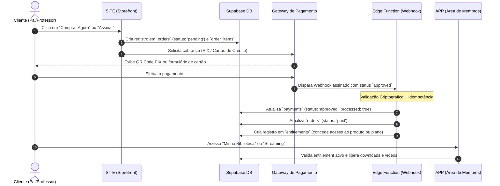

# 06 — COMPRA, PAGAMENTO E CONCESSÃO DE ACESSO

Este documento detalha o ciclo financeiro e de autorização do **COM DEUS KIDS**, garantindo que clientes tenham seus acessos liberados de forma confiável, imediata e segura.

---

## 1. O Ciclo Completo de Compra



---

## 2. Modelagem das Tabelas Financeiras

### A. Pedidos (`orders`)
Registra a intenção de compra e o valor final cobrado:
* Snapshot dos dados do cliente (`customer_email`, `customer_name`).
* `subtotal`, `discount`, `total`, `currency` ('BRL').
* Status do pedido: `'pending'`, `'paid'`, `'cancelled'`, `'refunded'`, `'failed'`.

### B. Itens do Pedido (`order_items`)
Guarda o snapshot exato do momento da compra:
* `product_id` (para produtos avulsos) OU `plan_id` (para assinaturas).
* `unit_price`, `quantity`, `subtotal`.
* `title_snapshot`: O nome do produto no dia da compra (mesmo que seja renomeado no CMS futuramente).

### C. Pagamentos (`payments`)
Gerencia a liquidação financeira e a auditoria de gateway:
* `gateway`: `'mercadopago'`, `'stripe'`, `'asaas'`, `'pagseguro'`, etc.
* `gateway_payment_id`: Identificador único no gateway para evitar pagamentos duplicados.
* `status`: `'pending'`, `'approved'`, `'refused'`, `'refunded'`, `'chargeback'`.
* `raw_payload`: JSONB com o payload completo recebido do gateway para fins de auditoria e resolução de disputas.
* `processed`: Booleano para garantir que um mesmo webhook não gere duplo acesso (**Idempotência**).

---

## 3. Concessão de Direitos de Acesso (`entitlements`)

A tabela `entitlements` é a **única fonte de verdade** sobre o que um usuário tem direito de consumir:

```sql
CREATE TABLE public.entitlements (
  id          UUID PRIMARY KEY DEFAULT gen_random_uuid(),
  user_id     UUID NOT NULL REFERENCES auth.users(id) ON DELETE CASCADE,
  product_id  UUID REFERENCES public.products(id),
  plan_id     UUID REFERENCES public.plans(id),
  order_id    UUID REFERENCES public.orders(id),
  payment_id  UUID REFERENCES public.payments(id),
  expires_at  TIMESTAMPTZ, -- NULL para compras avulsas vitalícias
  revoked     BOOLEAN NOT NULL DEFAULT FALSE,
  revoked_at  TIMESTAMPTZ,
  revoked_reason TEXT,
  created_at  TIMESTAMPTZ NOT NULL DEFAULT NOW()
);
```

### Modalidades de Concessão:
1. **Compra Avulsa de Produto**: `expires_at = NULL` (acesso permanente àquele material e a suas futuras atualizações).
2. **Assinatura Recorrente**: `expires_at` é definido para o final do período faturado (ex: +30 dias no plano mensal, +365 dias no plano anual). É estendido a cada renovação.
3. **Liberação Administrativa**: Quando um administrador concede acesso de cortesia através do ADM (`/admin/clientes` ou `/admin/pedidos`), um entitlement é criado com justificativa registrada.

---

## 4. Regras Críticas de Segurança

1. **A página de sucesso NÃO concede acesso**: Redirecionar o navegador para `/sucesso` ou `/obrigado` após o checkout nunca deve ser o gatilho para liberar materiais. Se o usuário fechar a aba ou se a conexão cair, o acesso deve ser garantido via Webhook do servidor.
2. **Idempotência Obrigatória**: O webhook do gateway pode ser reenviado múltiplas vezes pela rede. O handler de webhook deve checar se `gateway_payment_id` já foi processado antes de criar novo entitlement.
3. **Cancelamento e Estorno (Refund/Chargeback)**: Se o gateway disparar evento de reembolso, o webhook deve atualizar o status do pedido para `refunded` e marcar o entitlement correspondente com `revoked = true` e `revoked_reason = 'estorno_solicitado'`.
